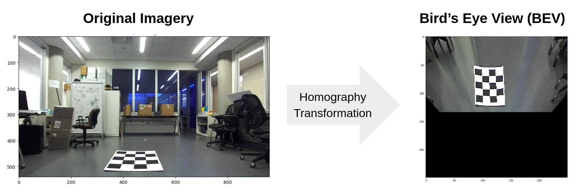

## BEV Homography

Bird's Eye View (BEV) homography projection is a sophisticated computer vision technique that mathematically transforms the perspective of images from a camera's viewpoint to a top-down, aerial perspective. This transformation is achieved through a homography matrix, which is derived from the camera's intrinsic parameters (like focal length and optical center) and its extrinsic parameters (such as position and orientation relative to the scene). By accurately mapping the pixels of an image to a new coordinate system, BEV projection offers a 'bird's eye' perspective of the environment, flattening the 3D world into a 2D plane while maintaining the spatial relationships of objects.

Homography projections are crucial in fields like autonomous driving. They significantly enhance decision-making and spatial awareness by providing a comprehensive, unobstructed view of the surroundings. This is particularly beneficial for detecting and navigating around obstacles, planning paths, and understanding complex scenes where traditional camera views may have limitations due to perspective and occlusion.

This project delivers an efficient and accessible implementation of BEV homography projection, enabling users to seamlessly transform conventional photographs into detailed Bird's Eye Views. Such capability greatly aids in improving object detection, path planning, and overall scene comprehension, thereby contributing to the advancement of autonomous systems and safety technologies.
